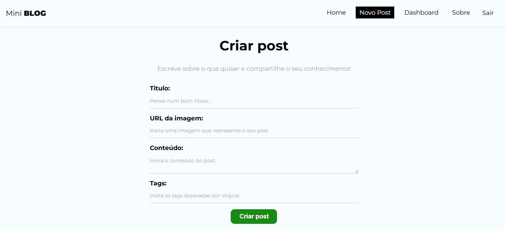
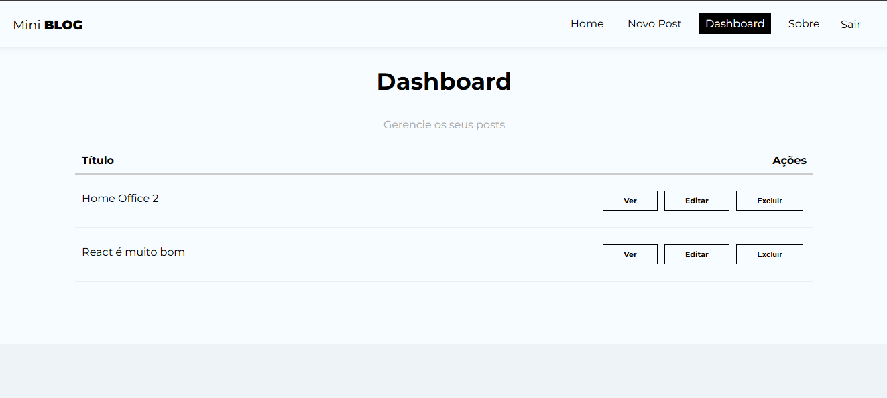
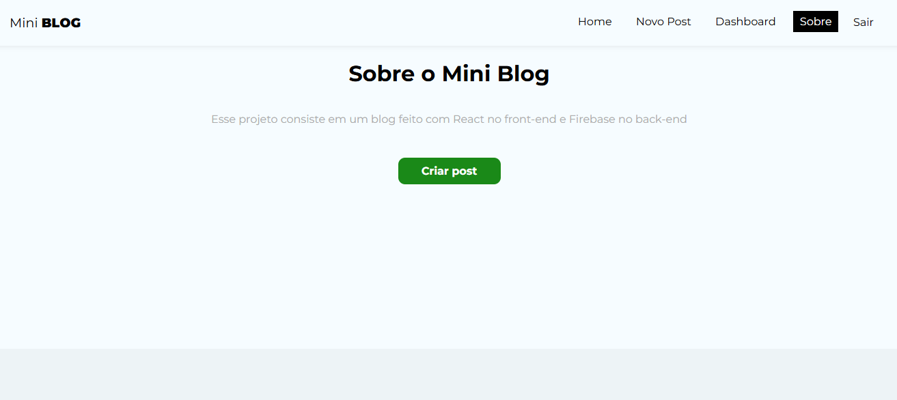
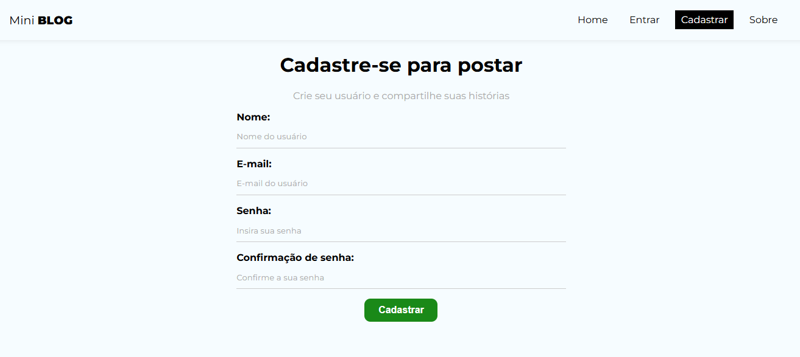

# mini-blog-react
Pequena aplicação de blog desenvolvida em react e firebase - Mini blog

- Home


##

- Novo


##

- Dashboard


##

- Sobre


##

- Cadastro


##

- Entrar


## Prerequisites

✔ - Node 18.19.1


## Quick Start

```
  
  - Rodar o comando para instalar as dependências na pasta principal do projeto: npm install

  - Rodar Projeto via nodemon com o comando npm start

  - Acessar a rota principal: http://localhost:3000/
  
```
